##---Git configuration commands

##---git config --global user.name
**syntax**
git config --global user.name "Name"
**Purpose:**
used to set username in Git so that every commit shows the username
**Example:**
git config --global user.name "Jwala"

##---git config -- global user.email
**syntax**
git config --global user.email "email"
**Purpose**
used to set email in Git so that every commit ahows the email
**Example**
git config --global user.email "n220043@rguktn.ac.in"

##---git config --list
**syntax**
git config --list
**Purpose**
displays all the current Git configuration settings and helps to verify whether the configuration has been set correctly.

##---git config --unset
**syntax**
git config --unset
**Purpose**
used to remove or delete a specific Git configuration value.

**screenshot**

##---Repositary setup commands 
git init
**screenshot**
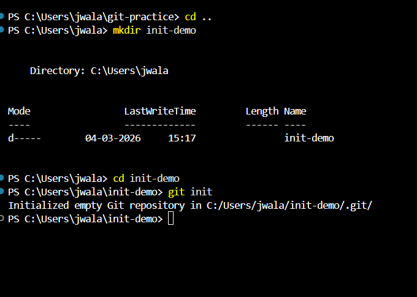

git clone
**screenshot**
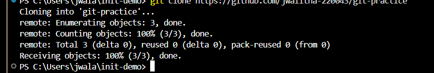

git clone --branch
**screenshot**
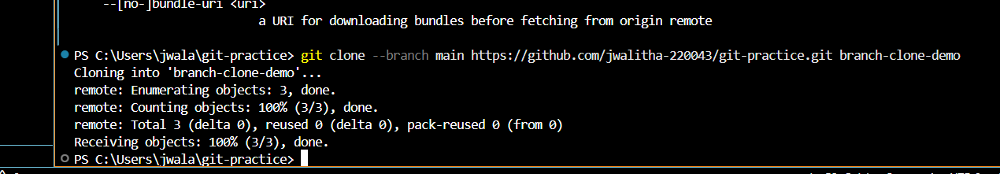

git clone --depth
**screenshot**
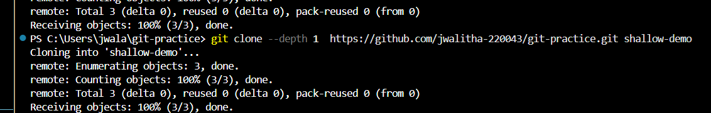

##---Repositary Status and Inspection
git status
**purpose**
shows current state of the working directory and staging area
git log
**Purpose**
displays complete commit history of the repositary.
git log --oneline
**purpose**
shows commit history in a compact one-line format
git log --graph
**purpose**
displays commit history in a graphical branch structure
 git show
 **purpose**
 displays detailed information about particular commit
 git diff
 **purpose**
 shows changes between working directory and last commit 
 git diff --staged
 **purpose**
 difference betwee staged changes and last commit
 git blame
 **purpose**
 shows who last modified each line of a file.
 git reflog
 **purpose**
 shows history of HEAD movements and recent actions
 git shortlog
 **Purpose**
 summarizes commit history by author

 **Screenshots**
 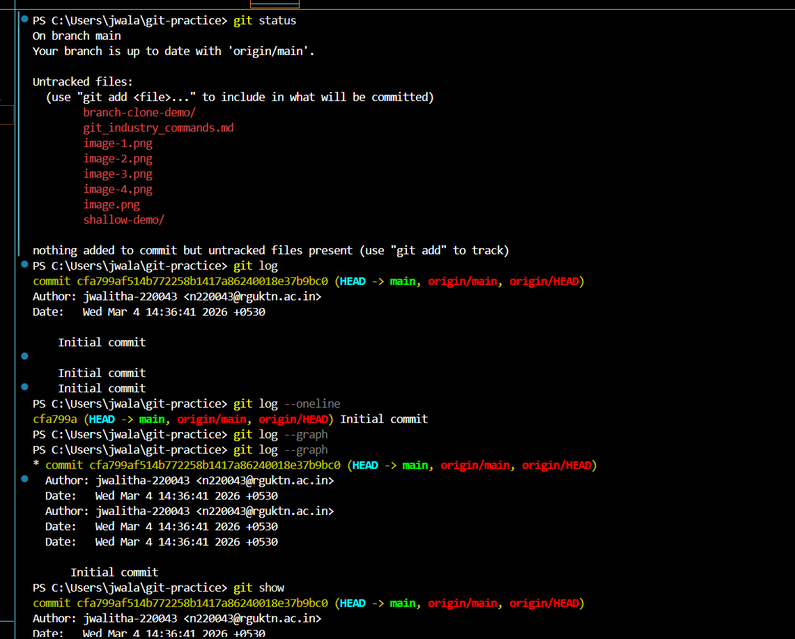
 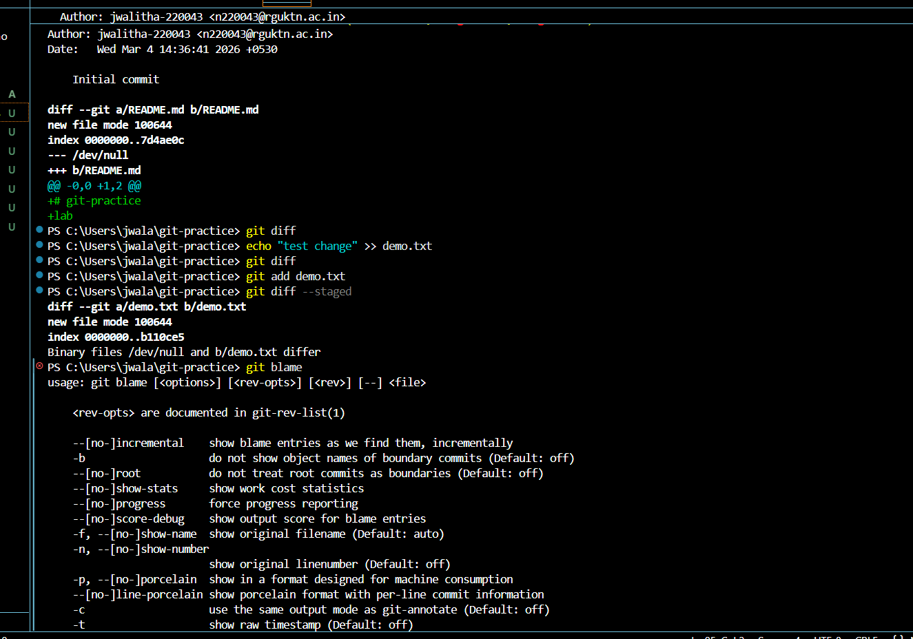
 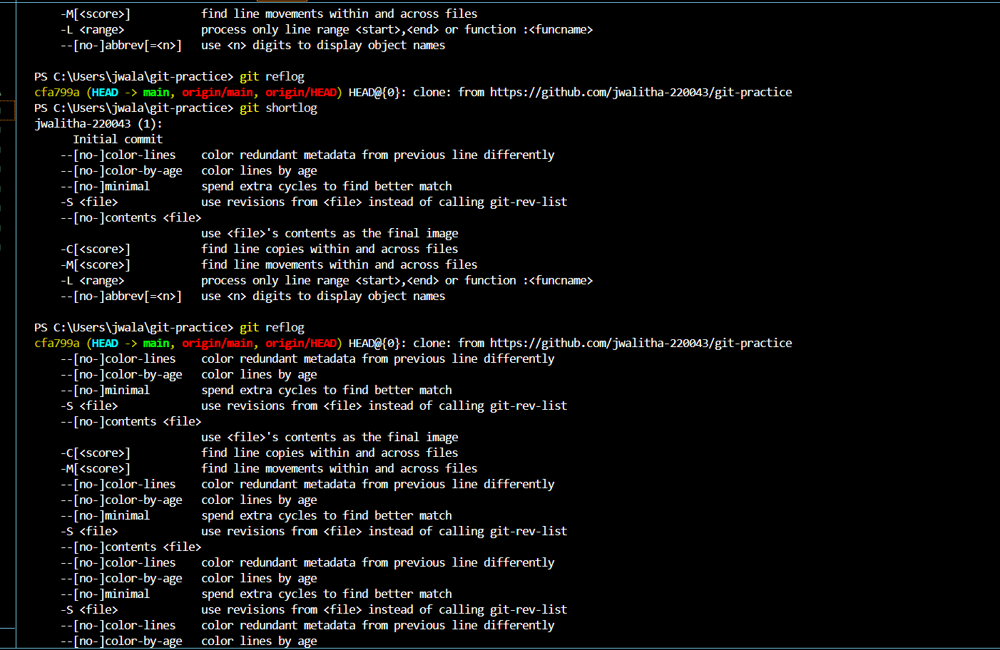
 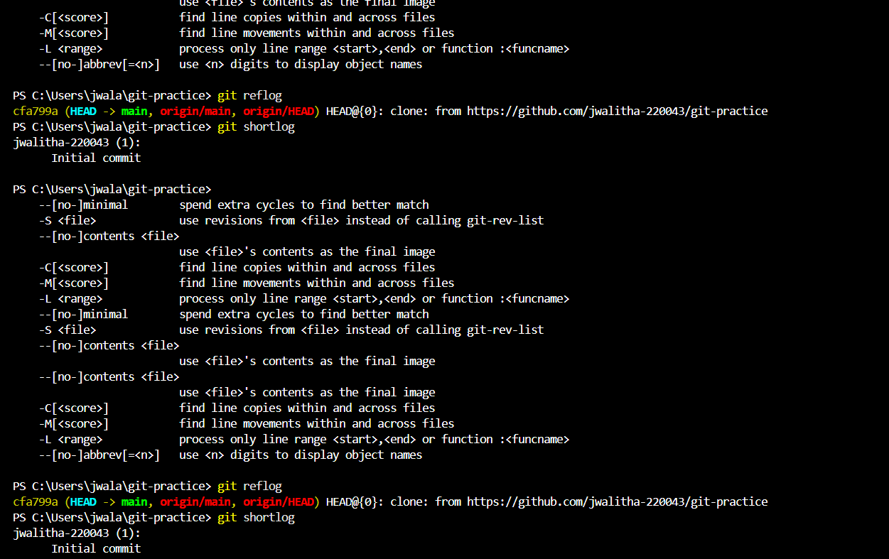

 ##---File Tracking Commands
 git add
 git add .
 git add -p
 git restore
 git restore --staged
 git rm
 git mv
 **screenshots**
 
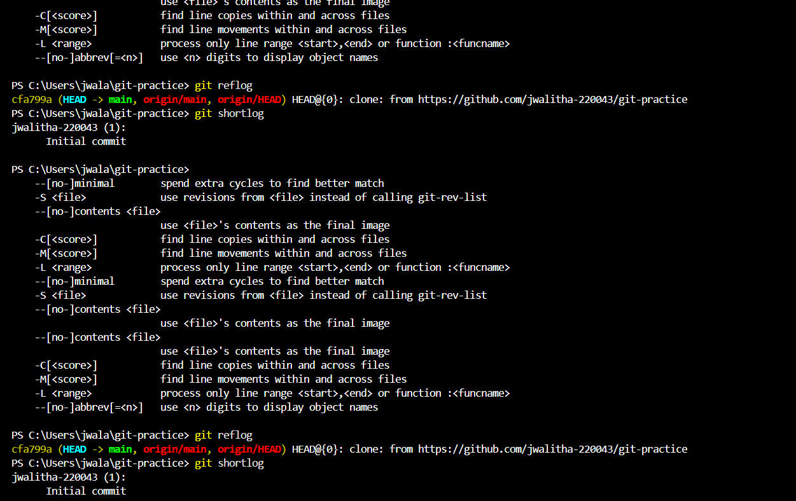
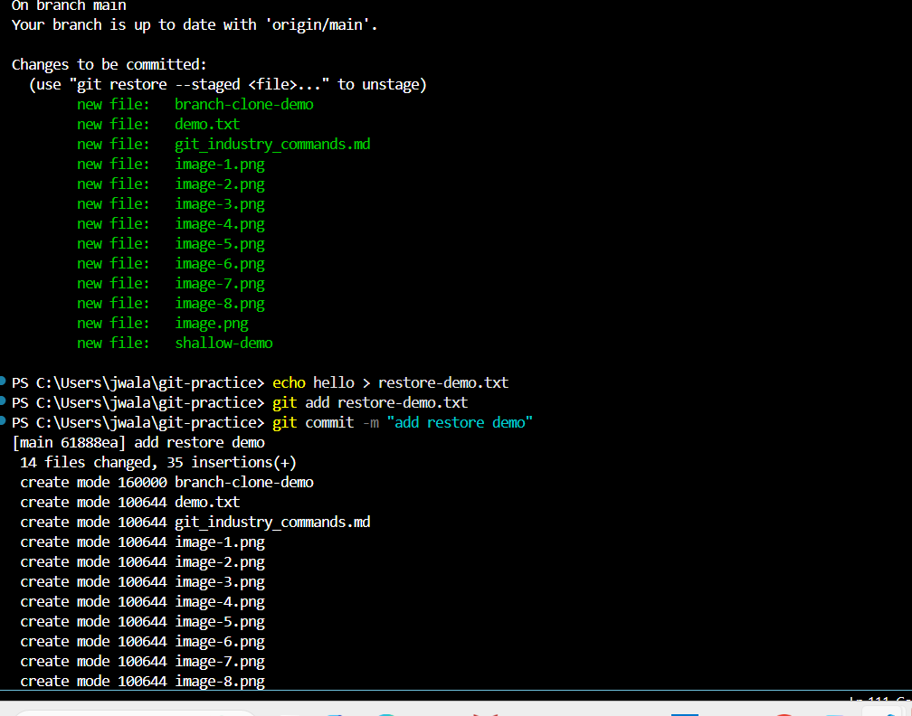

##---commit commands
git commit
git commit-m
git commit--amend
git commit--no-edit

**screenshots**
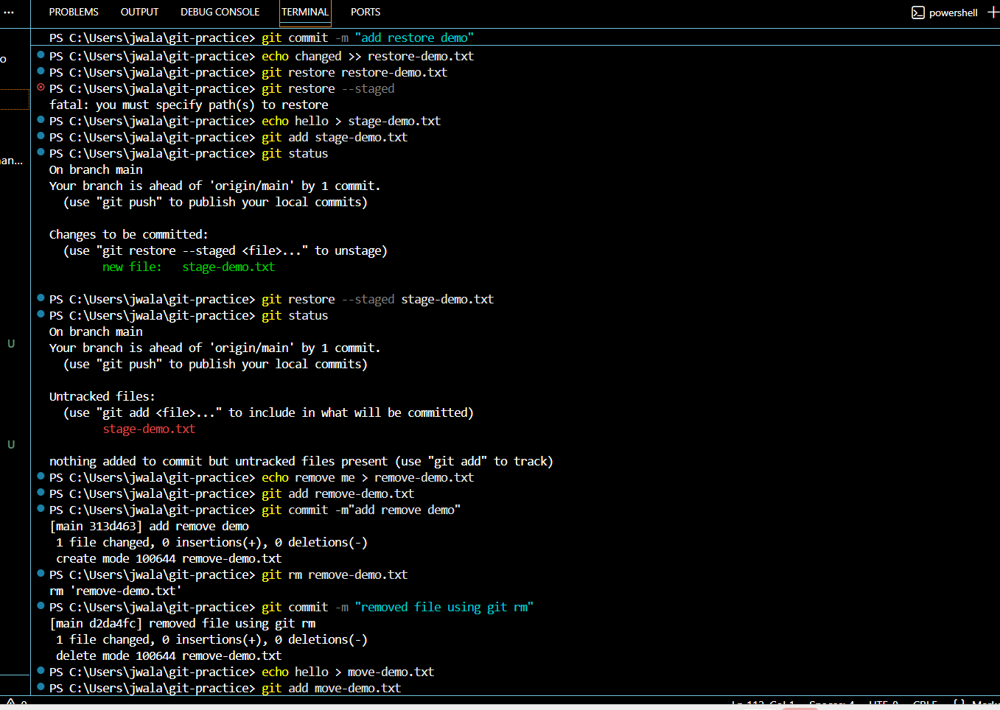

##---branch management
git branch
git branch-a
git branch-d
git branch-D
git checkout
git checkout-b
git switch
git switch-c

**screenshots**
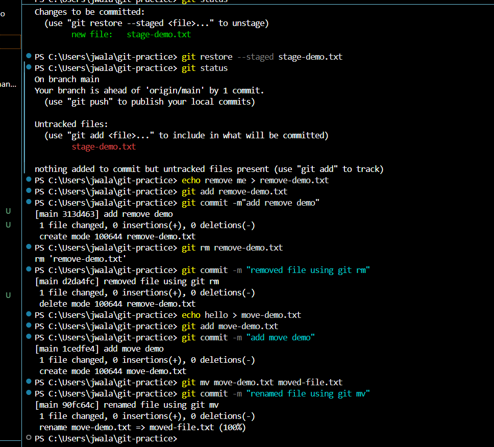

##---Merge and Integration
git merge
git merge --no-ff
**screenshot**
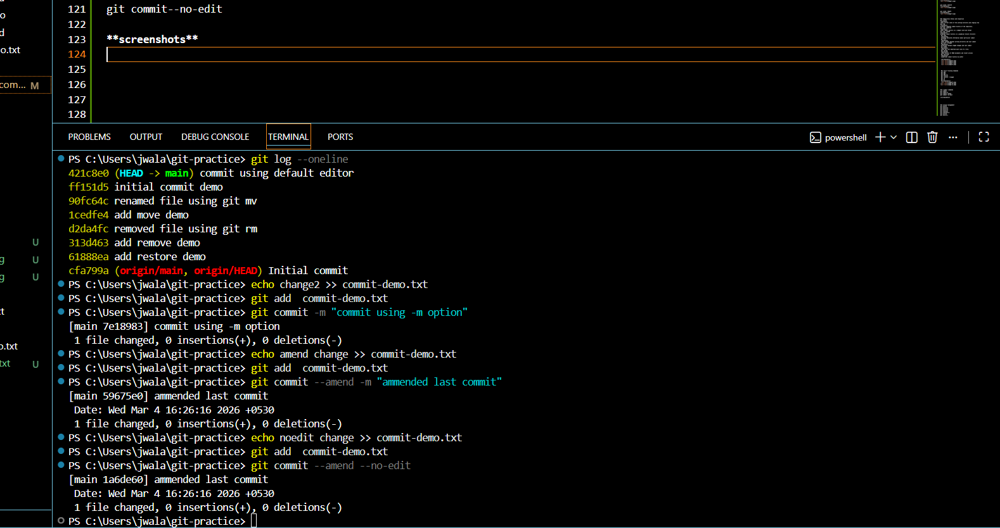
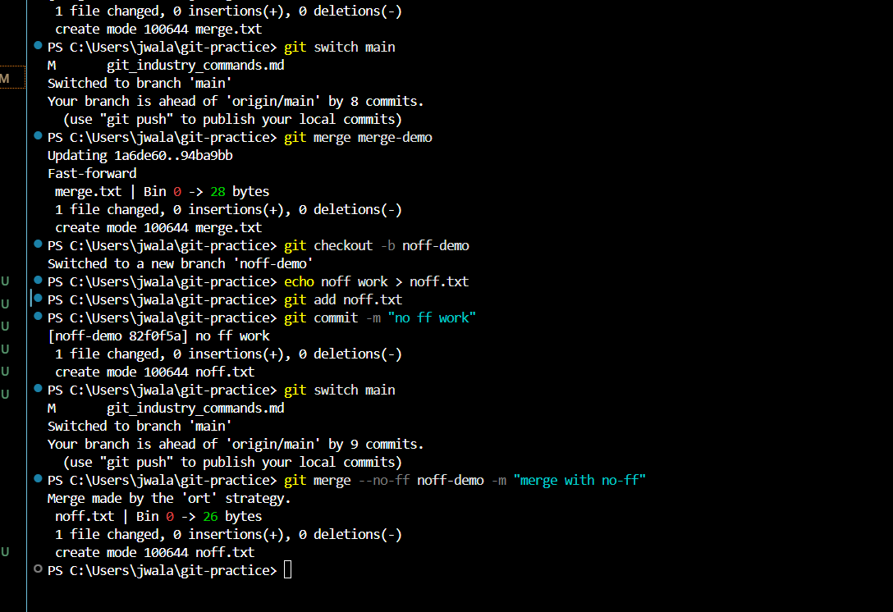

##---Remote and Repository
git remote
git remote -v
git remote add
git remote remove
git fetch
git fetch --all
git pull
git pull --rebase
git push
git push -u origin branch-name
git push --force
**screenshot**
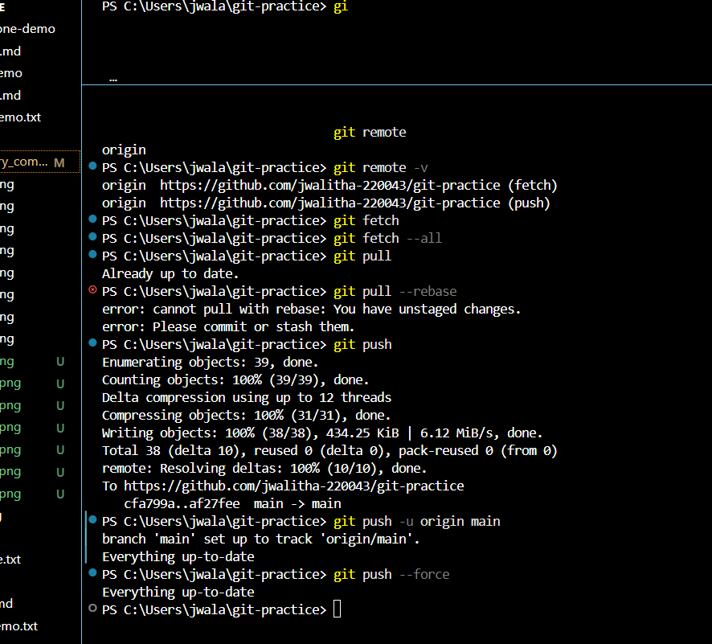

##---Stadh commands
git stash
git stash list
git stash pop
git stash apply
git stash drop
git stash clear
**screenshot**
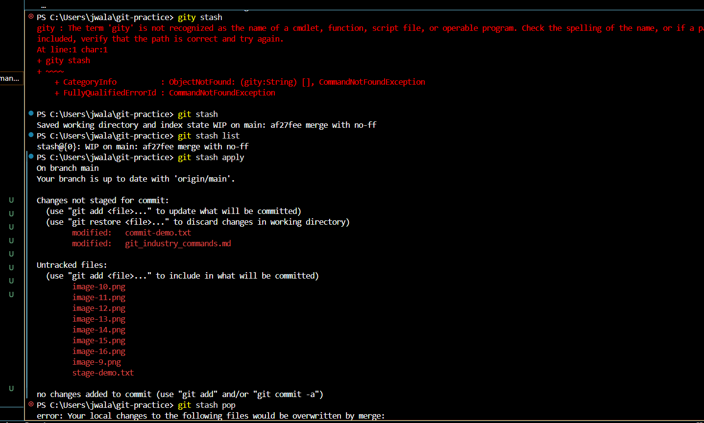
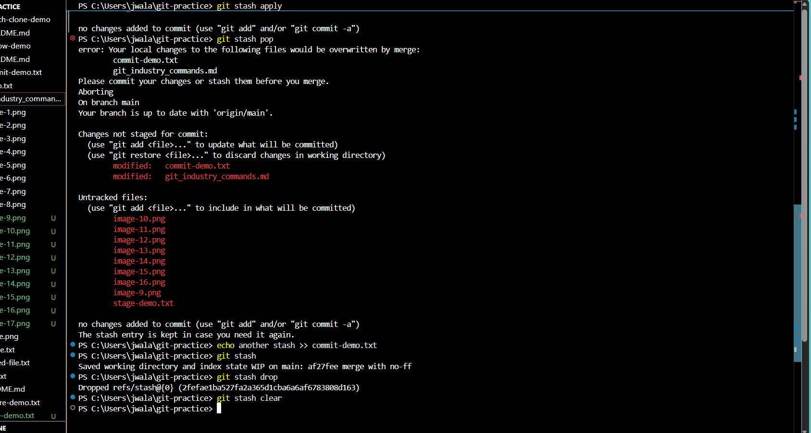

##---reset and undo
git reset 
git reset --soft
git reset --mixed
git reset --hard
git revert
git clean -f
git clean -fd
**screenshots**
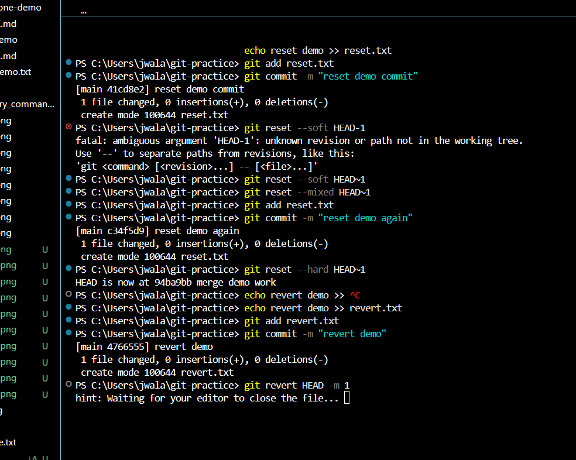
