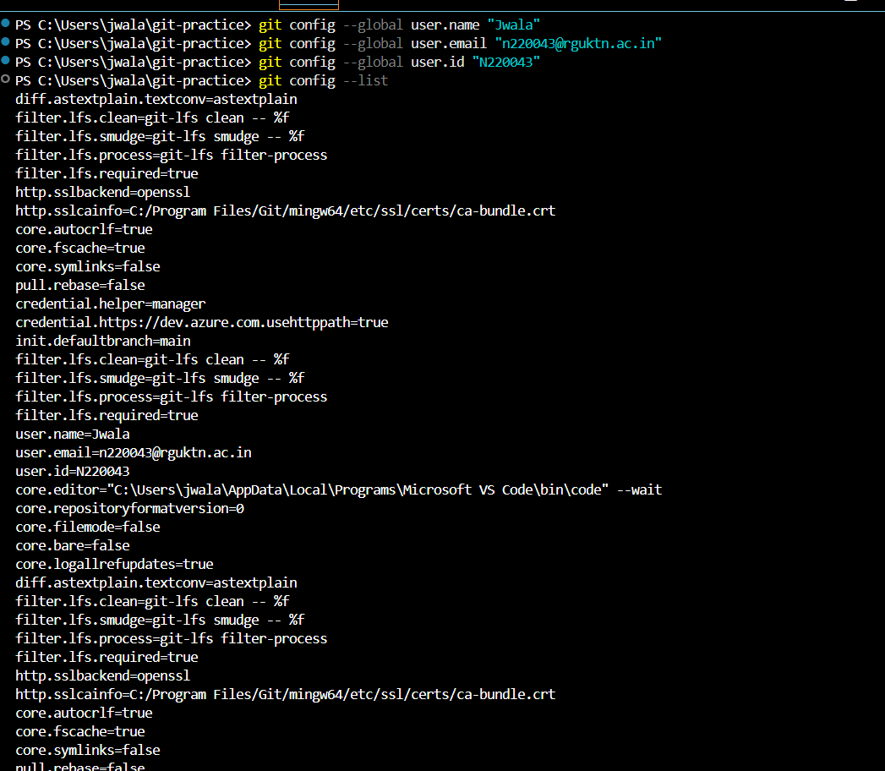

##---git config --global user.name
**syntax**
git config --global user.name "Name"
**Purpose:**
used to set username in Git so that every commit shows the username
**Example:**
git config --global user.name "Jwala"

##---git config -- global user.email
**syntax**
git config --global user.email "email"
**Purpose**
used to set email in Git so that every commit ahows the email
**Example**
git config --global user.email "n220043@rguktn.ac.in"

##---git config --list
**syntax**
git config --list
**Purpose**
displays all the current Git configuration settings and helps to verify whether the configuration has been set correctly.

##---git config --unset
**syntax**
git config --unset
**Purpose**
used to remove or delete a specific Git configuration value.

**screenshot**

